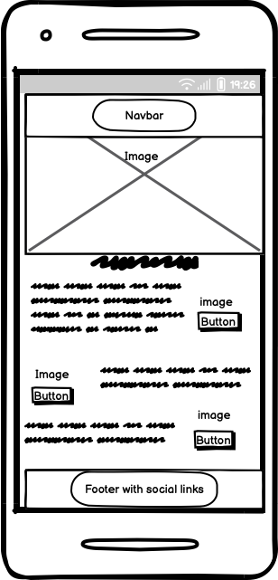
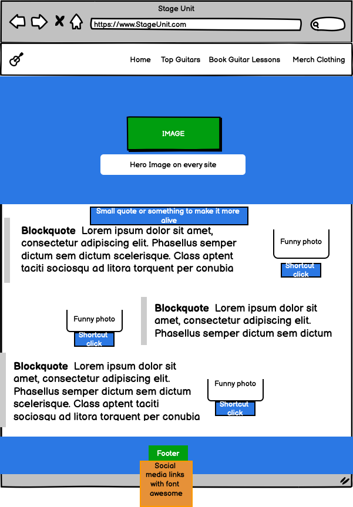

=======


# Stage Unit

Stage Unit is a small music website.  
It shows the best guitars I recommend, online guitar lessons, and Stage Unit merch.  
The goal is to help beginners and music fans find gear and learn guitar in a simple way.

---


## Project Purpose

- Show good quality guitars that are affordable.  
- Let users book online guitar lessons and learn from anywhere.  
- Offer official Stage Unit merchandise like shirts, hats, and more.  

We want to inspire people to start playing music again and show that anyone can learn guitar if they practice.


## Target Users

- Beginner to intermediate guitar players.  
- Music fans interested in merch and gear.  
- Anyone who wants to improve their guitar skills or just buy a cool shirt or a guitar for fun.


## Planned Pages/Sections

- **Home** – Welcome page with main information about Stage Unit and links to other sections.  
- **Guitar Shop** – Shows recommended guitars with links to buy them.  
- **Online Lessons** – Lets users book guitar lessons online.  
- **Merch** – Shows Stage Unit clothing and accessories.


  ## Wireframes

  I made wireframes before building the site to plan the layout for both mobile and desktop.  
This helped me decide where to put everything, like text, buttons, navbar, and so on.

### Mobile


### Desktop



## UX and Design Features

- Main navigation menu with clear links to **Home**, **Guitar Lessons**, and **Merch**.  
- Simple and structured layout using HTML.  
- Strong visual contrast for better readability.  
- Responsive design with media queries so it works on all devices.  
- No popups, clear and easy user flow.  
- High quality photos and clean, readable fonts.

## Tools & Tech

- **HTML5** – For the structure of the site.  
- **CSS3** – For styling and layout.  
- **Git & GitHub** – For version control and storing the code online.  
- **GitHub Pages** – For hosting and deploying the site.

 


  ## Help/ aid tools
  
   - Favicon help https://www.youtube.com/watch?v=Gpa780F9haQ
   - Google Fonts
   - Bootstrap
   - Fontawesome
   - Youtube
   - https://www.adobe.com/express/feature/image/remove-background/png/transparent
   - Sora AI for website images
  
## Lighthouse Diagnostics Desktop and Mobile
- Large contentful paint element.
- preconnect to required origins.
- eliminate render-blocking resources.
- image elements need to have width description and height to make lighthouse read it easier.
- had some yellow diagnostics from javascript but im not using javascript.
- for the most part was the problem the images and the sizes of them.
  
### Lighthouse Diagnostics what i did
- i wrote in <img  width and height the photos
- i changed the images px to match the desktop and mobile requirements
- validate html and css so everything is correct
  
  

## Site owner's goal
To spread more interest in playing guitar and instruments overall. The goal is to guide people toward learning productive skills through music.

## Development Process

This is how I built the site in simple steps:

1. **Idea:** I wanted a small music website for guitars, lessons, and merch.
2. **Planning:** I wrote a few user stories and drew simple wireframes (mobile + desktop).
3. **Design:** I picked colors and fonts that are easy to read and have good contrast.
4. **Build:** I made the HTML pages first, then added CSS. I used Bootstrap for layout and the navbar.
5. **Content:** I added images and short text for each section so it is simple to understand.
6. **Testing:** I clicked all links and buttons, tested the form, checked responsiveness, and ran HTML/CSS validators.
7. **Fixes:** I resized images (faster load), added `target="_blank" rel="noopener"` to external links, and improved titles.
8. **Deploy:** I pushed to GitHub and published with GitHub Pages (see Deployment section).
9. **Next steps:** Add more screenshots, more guitars, and maybe a real backend form later.


## Manual Testing

  - **HTML Validation** All pages (index.html, merch.html, book-guitar-lesson.html, guitar-shop.html) pass the W3C Validator.
  - **CSS Validation** style.css passed validation without errors.
  - **Lighthouse Audit**
  - Desktop Performance: 98%
  - Mobile Performance: 74%
  - Best Practices: 96%
  - Issues mostly related to large image file sizes (now resolved by resizing and setting correct width/height attributes).
   - **Responsiveness Testing**
     **Tested manually on:**
  - Mobile (Chrome dev tools)
  - Desktop
  - XXL desktop screen
  - **Functionality Testing**
  - All nav links work correctly.
  - Buttons lead to the correct pages.
  - Form elements are responsive and usable.


### Manual Testing Table

| Page              | Feature                  | Expected Result                                   | Testing Method                                 | Actual Result                                 | Fix Needed |
|-------------------|--------------------------|---------------------------------------------------|------------------------------------------------|-----------------------------------------------|------------|
| Home              | Navbar links             | Go to correct page when clicked                   | Clicked each navbar link                       | All worked correctly                          | None       |
| Home              | Hero image               | Image loads and looks good                        | Loaded site and checked image                  | Image loaded fine                             | None       |
| Guitar Shop       | External link (PriceRunner) | Opens in new tab                               | Clicked each PriceRunner link                  | Opened in new tab                             | None       |
| Guitar Shop       | Product images           | Show correct guitar images                        | Viewed page                                    | All images correct                            | None       |
| Guitar Shop       | Buy buttons              | Go to external shop in new tab                    | Clicked each button                            | All worked                                    | None       |
| Book Guitar Lesson| Form submit               | Requires all fields before sending                | Tried empty form                               | Got error messages for required fields        | None       |
| Book Guitar Lesson| Email input               | Only accepts valid email                          | Typed wrong format                             | Error shown                                   | None       |
| Book Guitar Lesson| Dropdown (Instrument)     | Can select an instrument                          | Tried selecting each option                    | All worked                                    | None       |
| Merch             | “Buy now” buttons (placeholder) | Stay on page (no navigation)                  | Clicked each button                            | Worked as placeholder                         | None       |
| All pages         | Responsiveness            | Content adjusts for mobile/tablet/desktop         | Tested with Chrome DevTools                    | Layout adjusts well                           | None       |
| All pages         | HTML & CSS validation     | No validation errors                              | Used W3C and Jigsaw validators                 | Passed both                                   | None       |


## Deployment

### How I Published the Site
1. Created a repository on GitHub named "Stage-unit"
2. Used these commands to upload my code:
   ```bash
   git add .
   git commit -m "First version with all pages"
   git push

3. Published using GitHub Pages:
- Went to repository Settings
- Scrolled to Pages section
- Selected main branch
- Clicked Save
- Waited for live link
  

 ### Run Locally
 
1. Clone the repository:

bash
git clone https://github.com/mathiase4/Stage-unit.git

2. Open folder in VS Code

3. Launch with:

Right-click index.html > "Open with Live Server" 

OR double-click index.html in file explorer

   

  ## bugs
  - have a problem with git add . --- git commit -m "bla" hard to connect to GitHub.
  -had problem with lighthouse how to form the images smaller and less KB and px.
  
 


