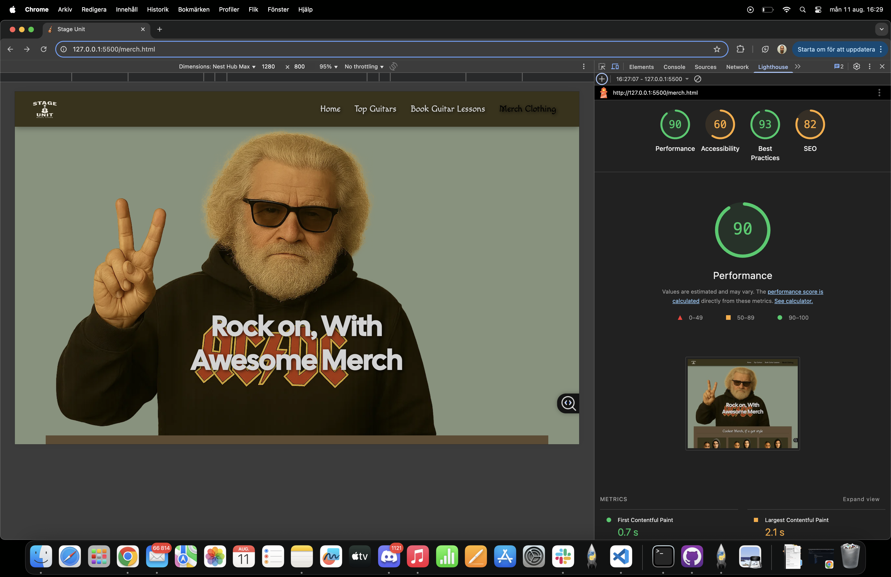

=======


# Stage Unit

Stage Unit is a small music website.  
It shows the best guitars I recommend, online guitar lessons, and Stage Unit merch.  
The goal is to help beginners and music fans find gear and learn guitar in a simple way.

---

## Table of Contents
- [Project Purpose](#project-purpose)
- [Target Users](#target-users)
- [Planned Pages/Sections](#planned-pagessections)
- [Wireframes](#wireframes)
- [UX and Design Features](#ux-and-design-features)
- [Tools & Tech](#tools--tech)
- [Help / Aid Tools](#help-aid-tools)
- [Lighthouse Diagnostics](#lighthouse-diagnostics-desktop-and-mobile)
- [What I Did for Lighthouse](#lighthouse-diagnostics-what-i-did)
- [Site Owner’s Goal](#site-owners-goal)
- [Development Process](#development-process)
- [Manual Testing](#manual-testing)
- [Manual Testing Table](#manual-testing-table)
- [Deployment](#deployment)
- [Bugs](#bugs)


### Project Purpose

- Show good quality guitars that are affordable.  
- Let users book online guitar lessons and learn from anywhere.  
- Offer official Stage Unit merchandise like shirts, hats, and more.  

We want to inspire people to start playing music again and show that anyone can learn guitar if they practice.


## Target Users

- Beginner to intermediate guitar players.  
- Music fans interested in merch and gear.  
- Anyone who wants to improve their guitar skills or just buy a cool shirt or a guitar for fun.


## Planned Pages/Sections

- **Home** – Welcome page with main information about Stage Unit and links to other sections.  
- **Guitar Shop** – Shows recommended guitars with links to buy them.  
- **Online Lessons** – Lets users book guitar lessons online.  
- **Merch** – Shows Stage Unit clothing and accessories.


  ## Wireframes

  I made wireframes before building the site to plan the layout for both mobile and desktop.  
This helped me decide where to put everything, like text, buttons, navbar, and so on.

### Mobile


### Desktop


## UX and Design Features

- Main navigation menu with clear links to **Home**, **Guitar Lessons**, and **Merch**.  
- Simple and structured layout using HTML.  
- Strong visual contrast for better readability.  
- Responsive design with media queries so it works on all devices.  
- No popups, clear and easy user flow.  
- High quality photos and clean, readable fonts.

## Tools & Tech

- **HTML5** – For the structure of the site.  
- **CSS3** – For styling and layout.  
- **Git & GitHub** – For version control and storing the code online.  
- **GitHub Pages** – For hosting and deploying the site.

 


  ## Help/ Aid tools
  
   - Favicon help https://www.youtube.com/watch?v=Gpa780F9haQ
   - Google Fonts
   - Bootstrap
   - Fontawesome
   - Youtube
   - https://www.adobe.com/express/feature/image/remove-background/png/transparent
   - Sora AI for website images
  
## Lighthouse Diagnostics Desktop and Mobile
- Large contentful paint element.
- preconnect to required origins.
- eliminate render-blocking resources.
- image elements need to have width description and height to make lighthouse read it easier.
- had some yellow diagnostics from javascript but im not using javascript.
- for the most part was the problem the images and the sizes of them.
  
### Lighthouse Diagnostics what i did
- wrote width and height in the  tags
- changed image sizes for desktop and mobile
- checked and fixed HTML and CSS

  
  

## Site owner's goal
To spread more interest in playing guitar and instruments overall. The goal is to guide people toward learning productive skills through music.

## Development Process

This is how I built the site in simple steps:

1. **Idea:** I wanted a small music website for guitars, lessons, and merch.
2. **Planning:** I wrote a few user stories and drew simple wireframes (mobile + desktop).
3. **Design:** I picked colors and fonts that are easy to read and have good contrast.
4. **Build:** I made the HTML pages first, then added CSS. I used Bootstrap for layout and the navbar.
5. **Content:** I added images and short text for each section so it is simple to understand.
6. **Testing:** I clicked all links and buttons, tested the form, checked responsiveness, and ran HTML/CSS validators.
7. **Fixes:** I resized images (faster load), added `target="_blank" rel="noopener"` to external links, and improved titles.
8. **Deploy:** I pushed to GitHub and published with GitHub Pages (see Deployment section).
9. **Next steps:** Add more screenshots, more guitars, and maybe a real backend form later.


## Manual Testing

- **HTML Validation** – I tested all pages (index.html, merch.html, book-guitar-lesson.html, guitar-shop.html) in W3C Validator. No errors.

- **CSS Validation** – style.css passed without errors in Jigsaw validator.

**Lighthouse Audit** (11 Aug 2025, deployed site)

- **Desktop**: Performance 98%, Best Practices 96%, Accessibility 100%, SEO 100%

- **Mobile**: Performance 74%, Best Practices 96%, Accessibility 100%, SEO 100%
Most problems were from big image sizes. I fixed it by making images smaller and adding width/height in the HTML.

**Responsiveness Testing**
I checked:

- Mobile (Chrome DevTools)

- Desktop

- Big desktop screen
It worked fine on all.

**Functionality Testing**

- All navbar links go to the right page.

- Buttons go to the right place.

- Form works and is easy to use on all devices.


## Manual Testing Table


| Page               | What I tested         | What I expected                   | How I tested                      | What happened         | Fix  |
| ------------------ | --------------------- | --------------------------------- | --------------------------------- | --------------------- | ---- |
| Home               | Navbar links          | Go to the right page when clicked | Clicked all the links in the menu | All links worked fine | None |
| Home               | Main image            | Show up and look good             | Opened the page and checked       | Image showed fine     | None |
| Guitar Shop        | PriceRunner links     | Open in new tab                   | Clicked each link                 | Opened in new tab     | None |
| Guitar Shop        | Guitar images         | Show correct guitar pictures      | Looked at all the pictures        | All were correct      | None |
| Guitar Shop        | Buy buttons           | Go to shop in new tab             | Clicked buttons                   | Opened in new tab     | None |
| Book Guitar Lesson | Form submit           | Need all fields before sending    | Tried to send with empty fields   | Got error messages    | None |
| Book Guitar Lesson | Email field           | Only accept real email format     | Typed wrong format                | Got error message     | None |
| Book Guitar Lesson | Dropdown              | Should let me pick instrument     | Tried each option                 | Worked fine           | None |
| Merch              | Buy now buttons       | Stay on page (placeholder)        | Clicked buttons                   | Stayed on page        | None |
| All pages          | Mobile view           | Fit on small screen               | Checked in Chrome DevTools        | Looked fine           | None |
| All pages          | HTML & CSS validation | No errors                         | Used W3C and Jigsaw validators    | Passed                | None |


## Testing of User Stories

### User Story 1:

- As a beginner guitar player, I want to see affordable guitar options so I can choose the right one.
- Test: Went to "Guitar Shop" page.
- Expected: See guitar list with prices and links to buy.
- Result: All guitars are shown with images and buy buttons. Links open in a new tab. 

### User Story 2:

- As a user, I want to book an online guitar lesson so I can learn from home.
- Test: Filled in the booking form with all correct details.
- Expected: Form sends data after clicking "Submit".
- Result: Form worked and showed confirmation message. 

### User Story 3:

- As a music fan, I want to buy merch so I can support Stage Unit.
- Test: Clicked “Buy Now” on merch page.
- Expected: Button works (placeholder for now).
- Result: Button works and stays on page as expected. 

## Screenshots

Below are simple screenshots I took while testing:

All features on the site were tested manually.  
Testing was done on desktop and mobile devices using Chrome DevTools, W3C HTML Validator, Jigsaw CSS Validator, and Lighthouse.  
Each link, button, and form element was checked to make sure it works as expected.  


- Home (Desktop):  
  
  
  


- Guitar Shop page:  
  
  
  

- Book Guitar Lesson (form):  
  
  

- Merch page:  
  
  
  

  - Home (Mobile):  
  
  
  
  

- HTML Validation (W3C):
- Index.html code
  
- Merch.html code
  
- book-guitar-lesson.html code 
  
- guitar-shop.html code
  


- CSS Validation (Jigsaw):  
  

- Lighthouse result (Desktop):  
  

- Lighthouse result (Mobile):  
  


## Deployment

### Published to GitHub Pages
1. Created repo on GitHub
2. Ran in terminal:
   ```bash
   git add .
   git commit -m "First version"
   git push
   ```

3. Enabled Pages:
Settings > Pages > main branch > Save

Live at: https://mathiase4.github.io/Stage-unit/
  

 ### Run Locally
 
 ```bash
git clone https://github.com/mathiase4/Stage-unit.git
```


- Open in VS Code

- Right-click index.html > "Open with Live Server"

   


## Bugs and Fixes

- **Links opened in same tab**
Some links (like to PriceRunner) opened in the same tab and took me away from my site.
**Fix**: Made them open in a new tab.

- **Images too big**
Lighthouse said some images were too big and slowed the site.
**Fix**: Made images smaller and added width/height.

- **HTML/CSS errors**
The code checkers found some small mistakes.
**Fix**: Fixed them so no errors now.

- **Git push problem**
Couldn’t push my code to GitHub at first.
**Fix**: Checked my GitHub connection and tried again.

- **Lighthouse performance low**
Score was low because of big images.
**Fix**: Made images smaller.


  
 


